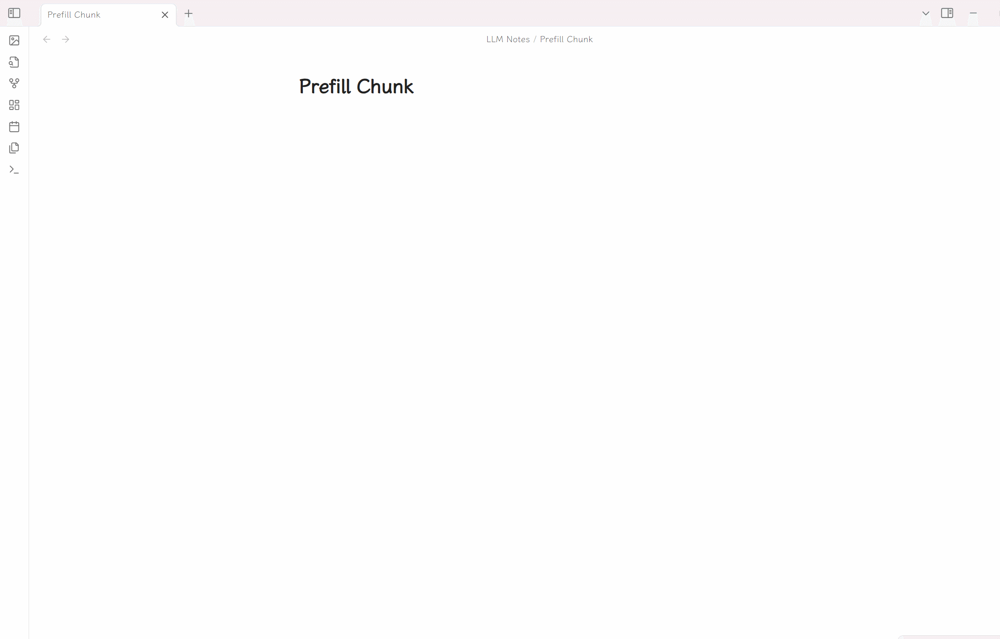

# Obsidian OSS Gallery 插件

### [English](./README.md) | 中文

这个插件可以把 Obsidian 中的文件上传到多个对象存储服务，并为支持列举对象的服务提供图库视图。

项目最初 fork 自 [Obsidian Minio Uploader Plugin](https://github.com/seebin/obsidian-minio-uploader-plugin)，目前已经扩展为多 provider 架构。

## 支持的存储服务

- **MinIO**：自托管 S3 兼容对象存储
- **Cloudflare R2**：S3 兼容对象存储
- **SM.MS**：图床
- **GitHub**：上传到仓库
- **阿里云 OSS**
- **腾讯云 COS**
- **七牛 Kodo**
- **又拍云 USS**
- **Imgur**：仅支持图片上传，不支持图库列举和删除

## 功能

- 支持命令面板上传、粘贴上传、拖拽上传
- 支持的文件类型：图片、视频、音频、`.doc`、`.docx`、`.pdf`、`.pptx`、`.xls`、`.xlsx`
- 支持全局对象命名规则和路径规则
- 支持全局基础路径前缀
- 支持图片、视频、音频、文档的插入/预览配置
- 对支持列举的 provider 提供图库视图
- 支持普通文本搜索和正则搜索
- 一键复制链接
- 对支持删除的 provider 可直接在图库中删除
- 支持图片全屏预览
- 图库包含懒加载、分批渲染、回到顶部和后台刷新

---

## 设置

先在插件设置里选择当前启用的 provider，再配置下面两类设置。

### 全局设置

- **Base path**：所有上传对象统一追加的前缀路径
- **对象命名规则**
  - `local`
  - `time`
  - `timeAndLocal`
- **对象路径规则**
  - `root`
  - `type`
  - `date`
  - `typeAndDate`
- **预览设置**
  - 图片预览开关
  - 视频预览开关
  - 音频预览开关
  - 文档预览服务：禁用、Google Docs、Office Online

### Provider 设置

#### SM.MS

- API Token

#### GitHub

- 仓库：`owner/repo`
- 分支
- Personal Access Token
- 自定义 URL：可选，适合 jsDelivr 等 CDN

#### 阿里云 OSS

- Access Key ID
- Access Key Secret
- Bucket
- Region，例如 `oss-cn-hangzhou`
- 路径前缀：可选
- 自定义域名：可选

#### 腾讯云 COS

- Secret ID
- Secret Key
- Bucket
- Region，例如 `ap-shanghai`
- 路径前缀：可选
- 自定义域名：可选

#### 七牛 Kodo

- Access Key
- Secret Key
- Bucket
- CDN 域名 URL
- 存储区域
- 路径前缀：可选

#### 又拍云 USS

- 操作员名称
- 密码
- 服务名称
- 加速域名 URL
- 路径前缀：可选
- 图片处理后缀：可选

#### Imgur

- Client ID
- Proxy URL：可选，部分地区需要

注意：Imgur 目前只支持上传，不支持图库列举和删除。

#### Cloudflare R2

- Account ID
- Access Key ID
- Secret Access Key
- Bucket
- Public URL：自定义域名或 `r2.dev` 地址

#### MinIO

- Endpoint
- Port
- Use SSL
- Access Key
- Secret Key
- Bucket
- Region：可选
- 自定义域名：可选

如果要让 MinIO 返回的链接可直接访问，需要在 Bucket 策略中开放匿名访问或提供公开可访问的对象 URL。

