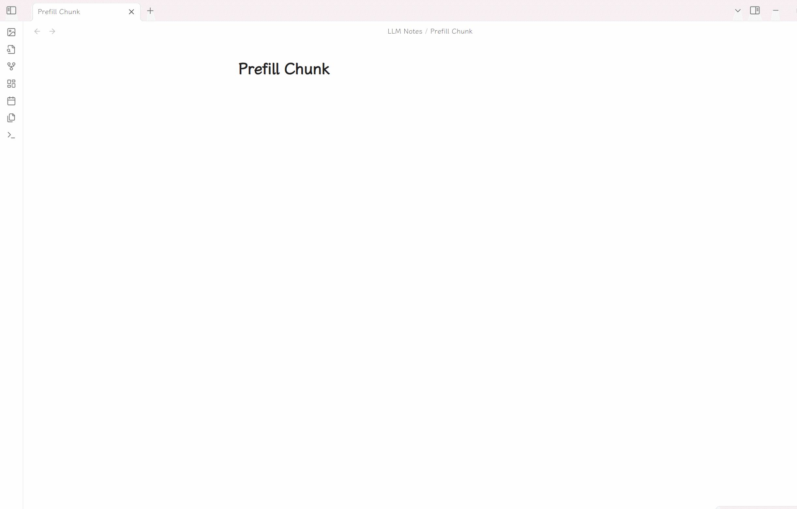
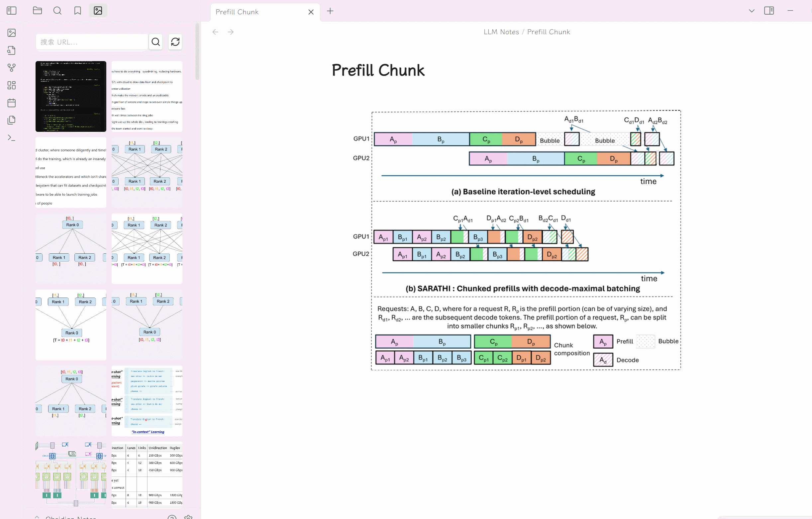
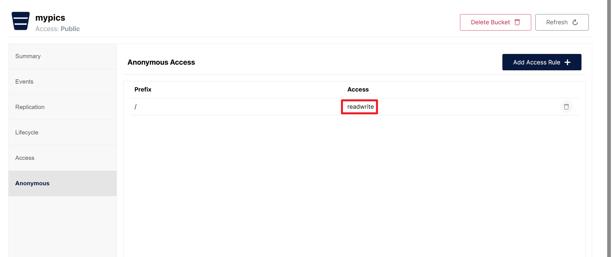

# Obsidian OSS Gallery 插件

### [English](./README.md) | 中文

这个插件可以把 Obsidian 中的文件上传到多个对象存储服务，并为支持列举对象的服务提供图库视图。

> **要求**：Obsidian 1.7.2 或更高版本。

> **注意**：本插件仅支持桌面端。它依赖 Obsidian 移动端不具备的 Node.js 能力（crypto 签名、本地文件系统）。

项目最初 fork 自 [Obsidian Minio Uploader Plugin](https://github.com/seebin/obsidian-minio-uploader-plugin)，目前已经扩展为多 provider 架构。

## 支持的存储服务

- **本地存储**：仅桌面端可用的本地文件管理，支持图库预览、删除到回收站
- **SM.MS**：图床
- **GitHub**：上传到仓库
- **阿里云 OSS**
- **腾讯云 COS**
- **七牛 Kodo**
- **又拍云 USS**
- **Imgur**：仅支持图片上传，不支持图库列举和删除
- **Cloudflare R2**：S3 兼容对象存储
- **S3**：通用 S3 兼容提供商（AWS S3、DigitalOcean Spaces、Backblaze B2 等）
- **MinIO**：自托管 S3 兼容对象存储

## 功能

- 支持命令面板上传、粘贴上传、拖拽上传
- 支持的文件类型：图片、视频、音频、`.doc`、`.docx`、`.pdf`、`.pptx`、`.xls`、`.xlsx`
- 支持全局对象命名规则和路径规则
- 支持全局基础路径前缀
- 支持图片、视频、音频、文档的插入/预览配置
- 对支持列举的 provider 提供图库视图
- 支持普通文本搜索和正则搜索
- 一键复制链接
- 对支持删除的 provider 可直接在图库中删除
- 支持图片全屏预览
- 图库包含懒加载、分批渲染、回到顶部和后台刷新

---

## 设置

先在插件设置里选择当前启用的 provider，再配置下面两类设置。

### 全局设置

- **Base path**：所有上传对象统一追加的前缀路径
- **对象命名规则**
  - `local`
  - `time`
  - `timeAndLocal`
- **对象路径规则**
  - `root`
  - `type`
  - `date`
  - `typeAndDate`
- **预览设置**
  - 图片预览开关
  - 视频预览开关
  - 音频预览开关
  - 文档预览服务：禁用、Google Docs、Office Online

### Provider 设置

#### 本地存储

- 仅支持 Obsidian 桌面端
- 存储路径：仓库相对路径，或会插入为 `file:///` 链接的绝对路径
- 使用仓库相对路径：开关（默认开启，仅支持本地文件仓库）
- 删除到回收站：删除文件时移到系统回收站（默认开启）

#### SM.MS

- S.EE API Key（SM.MS 已迁移至 S.EE，请在 S.EE 的 **工具 > API Token** 中创建）

#### GitHub

- 仓库：`owner/repo`
- 分支
- Personal Access Token
- 自定义 URL：可选，适合 jsDelivr 等 CDN

#### 阿里云 OSS

- Access Key ID
- Access Key Secret
- Bucket
- Region，例如 `oss-cn-hangzhou`
- 路径前缀：可选
- 自定义域名：可选

#### 腾讯云 COS

- Secret ID
- Secret Key
- Bucket
- Region，例如 `ap-shanghai`
- 路径前缀：可选
- 自定义域名：可选

#### 七牛 Kodo

- Access Key
- Secret Key
- Bucket
- CDN 域名 URL
- 存储区域
- 路径前缀：可选

#### 又拍云 USS

- 操作员名称
- 密码
- 服务名称
- 加速域名 URL
- 路径前缀：可选
- 图片处理后缀：可选

#### Imgur

- Client ID
- Proxy URL：可选，部分地区需要

注意：Imgur 目前只支持上传，不支持图库列举和删除。

#### Cloudflare R2

- Account ID
- Access Key ID
- Secret Access Key
- Bucket
- Public URL：自定义域名或 `r2.dev` 地址

#### S3（通用）

- Endpoint：S3 兼容端点（例如 `s3.amazonaws.com`）
- Region
- Access Key ID
- Secret Access Key
- Bucket
- 使用 SSL：开关（默认开启）
- 强制路径风格：使用 `endpoint/bucket/key` 而非 `bucket.endpoint/key`（默认开启）
- Public URL：可选，自定义文件访问 URL

#### MinIO

- Endpoint：主机名或完整 URL；显式填写的 `http://` / `https://` 协议和端口优先
- Port：Endpoint 为未指定端口的主机名时使用
- Use SSL：Endpoint 未包含 URL 协议时使用
- Access Key
- Secret Key
- Bucket
- Region：可选
- 自定义域名：可选

如果要让 MinIO 返回的链接可直接访问，需要在 Bucket 策略中开放匿名访问或提供公开可访问的对象 URL。

## 网络使用与隐私

本插件只会向你配置的存储服务发起网络请求，不含遥测、统计或广告，也不会向插件作者发送任何数据。

- **文件会发送到你选择的服务。** 上传、列表、删除会访问当前 Provider 的端点：
  - S3（通用） / MinIO：你填写的 Endpoint（MinIO 按配置使用 `http://` 或 `https://`）
  - Cloudflare R2：你的 R2 S3 端点（`<account>.r2.cloudflarestorage.com`）
  - 阿里云 OSS：`<bucket>.<area>.aliyuncs.com`（或自定义域名）
  - 腾讯云 COS：`<bucket>.cos.<region>.myqcloud.com`
  - 七牛 Kodo：`up-<area>.qiniup.com` 及七牛 API 域名
  - 又拍云 USS：`v0.api.upyun.com`
  - GitHub：`api.github.com`（链接默认使用 `raw.githubusercontent.com`，设置自定义域名后则使用你的域名）
  - Imgur：`api.imgur.com`，或你配置的代理
  - SM.MS（通过 S.EE）：`s.ee/api/v1`
  - 本地存储：不联网
- **文档预览。** 若将文档预览服务设为 Google Docs 或 Office Online，文档的公网 URL 会被发送到 `docs.google.com/viewer` 或 `view.officeapps.live.com` 以便渲染。保持“禁用”即可避免。
- **账号与费用。** 除本地存储外，每个 Provider 都需要你自己的账号（或自建服务）。部分服务是收费的，请查看各服务的定价。
- **仓库之外的本地文件。** 本地存储支持绝对路径。该模式下插件会读取、写入并（可选）把文件移入系统回收站，这些文件位于仓库之外，因为画廊需要列出并管理你指定的目录。插件只操作该目录。
- **凭据以明文保存。** Access Key、Token、Secret 会明文保存在仓库 `.obsidian/plugins/` 下插件的 `data.json` 中。如果你同步或提交仓库（Git、网盘），请排除该文件，或使用最小权限的密钥。
- **无遥测。** 插件不收集使用数据或崩溃报告。
