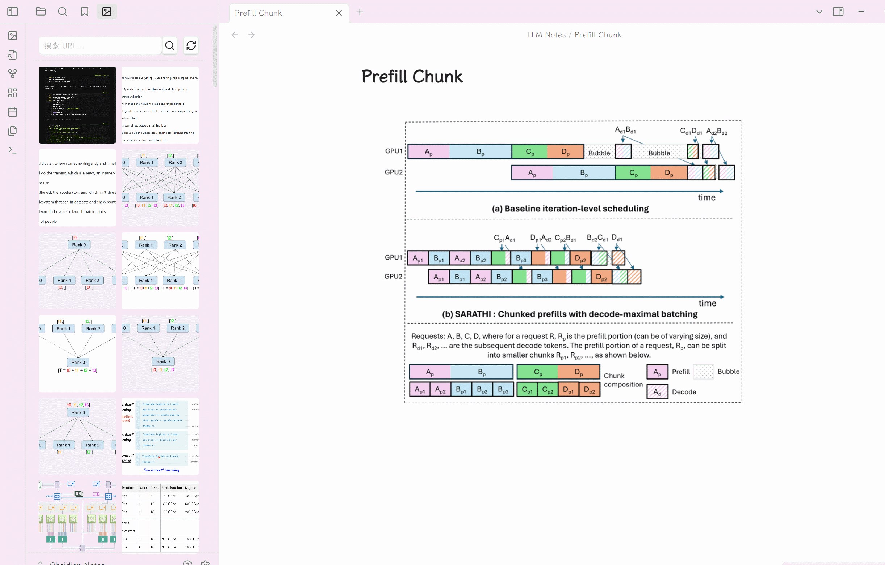
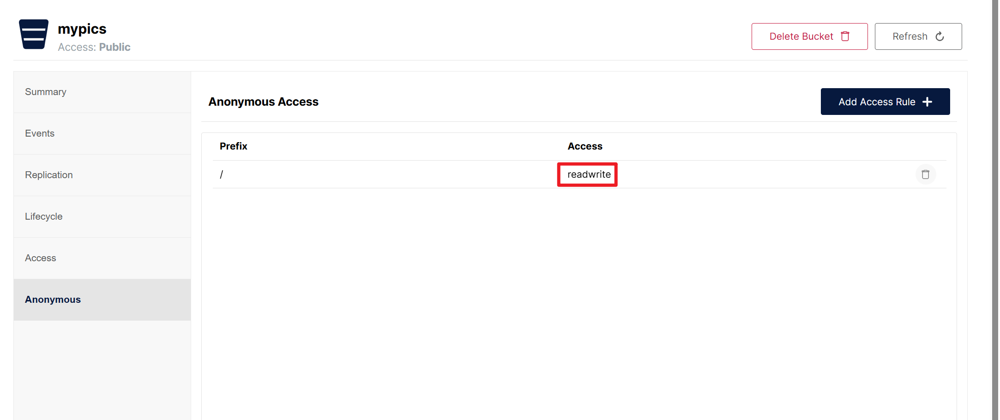

# Obsidian OSS Gallery Plugin

### English | [中文](./README-zh.md)

This plugin uploads files from Obsidian to multiple object storage providers and offers a gallery view for providers that support listing.

It started as a fork of [Obsidian Minio Uploader Plugin](https://github.com/seebin/obsidian-minio-uploader-plugin) and now supports a broader multi-provider workflow.

## Supported providers

- **Local**: desktop-only local file storage with gallery management
- **SM.MS**: image hosting
- **GitHub**: repository-backed uploads
- **Aliyun OSS**
- **Tencent COS**
- **Qiniu Kodo**
- **Upyun USS**
- **Imgur**: image upload only, no gallery listing or deletion in this plugin
- **Cloudflare R2**: S3-compatible object storage
- **S3**: generic S3-compatible provider (AWS S3, DigitalOcean Spaces, Backblaze B2, etc.)
- **MinIO**: self-hosted S3-compatible object storage

## Features

- Upload files from the command palette, paste, or drag and drop
- Supported file types: images, video, audio, `.doc`, `.docx`, `.pdf`, `.pptx`, `.xls`, `.xlsx`
- Global object naming and path rules
- Optional base path prefix for all uploads
- Configurable embed output for image, video, audio, and document preview
- Gallery view for providers that support listing
- URL search with plain text or regex mode
- One-click URL copy
- Delete from the gallery for providers that support deletion
- Full-screen image preview
- Lazy loading, batch rendering, back-to-top control, and background refresh for the gallery

---

## Settings

Choose an active provider in the plugin settings, then configure:

### Global settings

- **Base path**: optional prefix applied to every uploaded object key
- **Object naming rules**
  - `local`
  - `time`
  - `timeAndLocal`
- **Object path rules**
  - `root`
  - `type`
  - `date`
  - `typeAndDate`
- **Preview**
  - image preview on or off
  - video preview on or off
  - audio preview on or off
  - document preview provider: disabled, Google Docs, or Office Online

### Provider settings

#### Local

- Available in Obsidian desktop only
- Storage path: vault-relative directory, or absolute directory inserted as `file:///` links
- Use vault-relative path: toggle (default on, requires a local file-system vault)
- Delete to trash: move deleted files to system trash (default on)

#### SM.MS

- API token

#### GitHub

- Repository: `owner/repo`
- Branch
- Personal access token
- Custom URL: optional, for CDN such as jsDelivr

#### Aliyun OSS

- Access Key ID
- Access Key Secret
- Bucket
- Region, for example `oss-cn-hangzhou`
- Path prefix: optional
- Custom domain: optional

#### Tencent COS

- Secret ID
- Secret Key
- Bucket
- Region, for example `ap-shanghai`
- Path prefix: optional
- Custom domain: optional

#### Qiniu Kodo

- Access Key
- Secret Key
- Bucket
- CDN domain URL
- Storage area
- Path prefix: optional

#### Upyun USS

- Operator name
- Password
- Service name
- Acceleration domain URL
- Path prefix: optional
- Image processing suffix: optional

#### Imgur

- Client ID
- Proxy URL: optional, required in some regions

Note: Imgur uploads are supported, but gallery listing and deletion are not.

#### Cloudflare R2

- Account ID
- Access Key ID
- Secret Access Key
- Bucket
- Public URL: custom domain or `r2.dev` URL

#### S3 (Generic)

- Endpoint: S3-compatible endpoint (e.g. `s3.amazonaws.com`)
- Region
- Access Key ID
- Secret Access Key
- Bucket
- Use SSL: toggle (default on)
- Force path style: use `endpoint/bucket/key` instead of `bucket.endpoint/key` (default on)
- Public URL: optional custom URL for file access

#### MinIO

- Endpoint
- Port
- Use SSL
- Access Key
- Secret Key
- Bucket
- Region: optional
- Custom domain: optional

For MinIO public access, enable anonymous or otherwise publicly accessible object URLs in your bucket policy.

